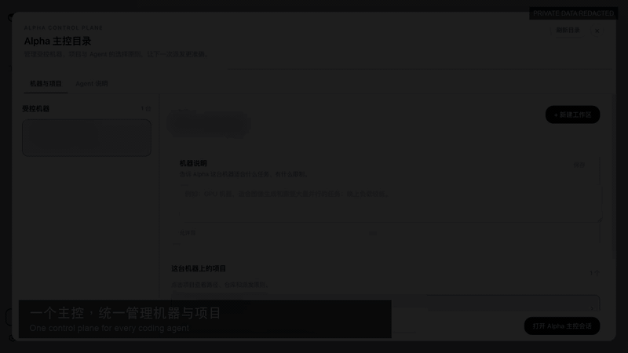

# dsh-alpha

[English](README.md) | 简体中文 · [在线站点](https://songofhawk.github.io/dsh-alpha/) · [架构设计](docs/design.md)

> 在一段 DSH 对话里，把编码任务派发到不同机器、不同 Agent runtime 的统一主控层。

_演示使用隔离环境；机器名、工作区和路径信息均已打码。_

## 为什么需要 dsh-alpha

单个编码 Agent 已经很有用，但真实工程很快会分散到笔记本、构建机、GPU 主机，以及路径各不相同的代码仓库。dsh-alpha 补上了中间缺失的控制面：

- 看清哪些机器、哪些 Agent 当前在线；
- 把不同机器上的同一个 Git 仓库识别为一个逻辑工作区；
- 按任务选择机器、runtime、模型、推理强度和权限模式；
- 把进度、审批、取消和结果持续回传到同一段对话；
- Worker 临时断线后重连，并恢复持久化的任务历史。

dsh-alpha 是 [DSH（DeepSeek Harness）](https://github.com/deepseek-ai/dsh) 插件。它负责编排已有的 provider CLI，不替代它们各自的安装、登录和安全控制。

## 一张图理解

~~~text
DSH Web / headless 主控
  ├─ 全局工作区目录
  ├─ Agent 能力与负载目录
  ├─ 任务 / 审批 / 恢复状态
  └─ 反向 WebSocket gateway
          ├─ Worker A → Codex / Claude Code
          ├─ Worker B → Kimi Code / ZCode
          └─ Worker C → OpenCode / Qoder / WorkBuddy
~~~

Worker 主动连接主控，因此不需要公网 IP。仓库身份与机器本地路径彼此分离，实际执行始终受每台 Worker 显式配置的 allowed roots 约束。

## 核心能力

| 能力 | 带来的变化 |
| --- | --- |
| 全局工作区目录 | 同一个仓库可以跨多台机器、多个本地路径聚合展示。 |
| 仓库感知调度 | 优先选择已经持有仓库的 Worker；确需 clone 时也只能落在 allowed root。 |
| 逐轮 Worker 控制 | 不离开当前对话，即可选择 Agent、模型、推理强度和权限模式。 |
| 事件驱动结果 | 只派发一次，按事件等待；中断后用同一个持久化 task ID 继续。 |
| 审批回传 | Worker 的审批请求回到当前 Alpha 会话，不再隐形挂起。 |
| 反向 gateway | Worker 以带认证的 WebSocket 主动连接主控，断线后自动重连。 |
| 运维工具 | Web 侧栏、headless runner、状态 CLI、Worker doctor 和多设备验收清单。 |

## 快速开始

### 环境要求

- DSH 支持的 Node.js 版本
- DSH `0.1.0-rc.8` 或更高版本
- pnpm（`dsh plugin` 会调用）
- 实际执行任务的机器上，已经安装并登录所需 provider CLI

~~~bash
dsh --version
pnpm --version
~~~

### DSH Web

~~~bash
dsh plugin --profile web add dsh-alpha
node ~/.dsh/profiles/web/node_modules/dsh-alpha/scripts/install-preset.mjs
dsh web
~~~

在 Web 侧栏打开 **Alpha 主控**，选择工作区或保留自动调度，然后创建会话。

### Headless 主控

~~~bash
dsh plugin --profile alpha add dsh-alpha
node ~/.dsh/profiles/alpha/node_modules/dsh-alpha/scripts/install-alpha-profile.mjs
dsh --profile alpha "用 list_agents 查看可用 Agent，派发一个简短任务，并汇报结果。"
~~~

安装脚本只更新 dsh-alpha 托管区块，不会覆盖区块之外的本地配置。

### 从源码开发

~~~bash
git clone https://github.com/songofhawk/dsh-alpha.git
cd dsh-alpha
npm install
npm run setup
npm test
~~~

## 接入远程 Worker

在主控端为每台 Worker 配置独立 token：

~~~bash
export DSH_ALPHA_GATEWAY_HOST=0.0.0.0
export DSH_ALPHA_GATEWAY_PORT=4310
export DSH_ALPHA_GATEWAY_TOKENS='build-1:replace-with-a-long-random-token'
~~~

在目标机器上安装并启动 Worker：

~~~bash
npm install dsh-alpha

export DSH_ALPHA_HUB_URL='ws://<master>:4310/'
export DSH_ALPHA_WORKER_MACHINE_ID='build-1'
export DSH_ALPHA_WORKER_TOKEN='replace-with-a-long-random-token'
export DSH_ALPHA_WORKER_ALLOWED_ROOTS='/work'

./node_modules/.bin/dsh-alpha-worker-doctor
./node_modules/.bin/dsh-alpha-worker
~~~

离开可信局域网或 VPN 后，请使用 `wss://` 并在网络层限制来源。不要把 token 放进仓库、URL、截图或进程日志。

## 支持的 runtime

Codex、Claude Code 和 Kimi Code 默认启用；其它 runtime 需要显式开启。

| Provider ID | Runtime | 默认状态 |
| --- | --- | --- |
| `codex` | Codex app server / CLI | 启用 |
| `claude-code` | Claude Code headless | 启用 |
| `kimi-code` | Kimi ACP | 启用 |
| `zcode` | 智谱 ZCode headless | 可选 |
| `opencode` | OpenCode ACP | 可选 |
| `qoder` | Qoder headless | 可选 |
| `workbuddy` | 腾讯 WorkBuddy（通过 codebuddy） | 可选 |

每个 runtime 都需要独立安装并完成登录。`mock` 只用于测试和本地诊断。

## 日常派发流程

1. `list_workspaces` 解析逻辑仓库及其机器位置。
2. `list_agents` 提供在线状态、能力、负载和工作区亲和度。
3. `dispatch_task` 返回持久化 `taskId`；`wait_task` 通过事件流等待，不做忙轮询。
4. `agent_approve` 或 `agent_cancel` 在当前 Alpha 会话处理 Worker 审批。
5. `task_status` 与 `task_result` 用于断线恢复或历史任务回读。

Web 工作区选择器可以形成明确的机器/项目硬约束。未手工选择时，调度器可以自动选择匹配 Worker，并把 Git 工作区 clone 到该 Worker 的 allowed root。

## 默认安全边界

- Gateway 缺少认证 token 时拒绝启动。
- 本机和远程路径都必须通过显式 allowed roots 校验。
- Clone 目标由 Worker 在允许范围内决定，任务不能提交任意落盘路径。
- Web 主控与 headless 主控不能占用同一个 gateway 端口。
- 健康检查只暴露存活状态和 Worker 数量，不暴露身份与密钥。
- Worker doctor 是只读检查，且不会打印 Worker token。
- 审批、取消、重连和中断恢复都有自动化测试覆盖。

## 常用命令

~~~bash
dsh-alpha status
dsh-alpha web
dsh-alpha run "总结当前工作区"
dsh-alpha-worker-doctor
dsh-alpha-worker
npm test
~~~

## 文档导航

- [设计与架构](docs/design.md)
- [部署指南](docs/deployment.md)
- [多设备验收清单](docs/multi-device-acceptance.md)
- [局域网访问 bundle](packages/dsh-lan-access/README.zh-CN.md)
- [Vendor adapter 说明](src/adapters/vendor/README.md)
- [宣传文章：中文](site/article.zh-CN.md) / [English](site/article.en.md)
- Doco 发布版：[中文](https://doco.page/s/k2KWDVuEhWMDUA5mGpf_nUd7hMI_Um-u) / [English](https://doco.page/s/WBbyHRtlsfr1lhwr_iDTLQbpdSXL0QeM)

## 项目状态

当前公开源码版本：**0.2.1**。仓库已经覆盖本机编排、反向 gateway Worker、仓库感知调度、递归主控、审批转发、全局工作区选择、任务持久化恢复，以及七种产品 runtime 集成。

升级线上实例后，请重新运行对应的 preset/profile 安装脚本，并按多设备验收清单逐台验证。
